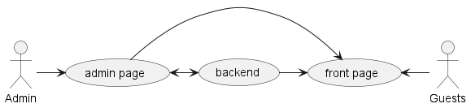

# 妙笔CMS(Skillful Pen CMS)  

一个能够让用户快速构建属于自己的CMS的项目

## 技术栈  

- [gofiber](https://docs.gofiber.io/)
- [jet](https://github.com/CloudyKit/jet)
- [vue](https://cn.vuejs.org/)
- [arco design](https://arco.design/)

## 用例图
